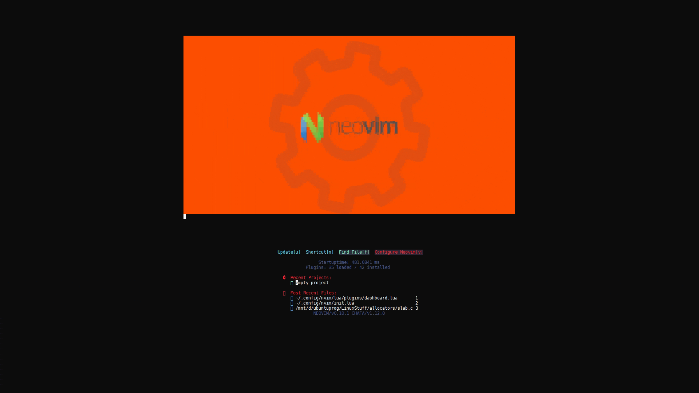
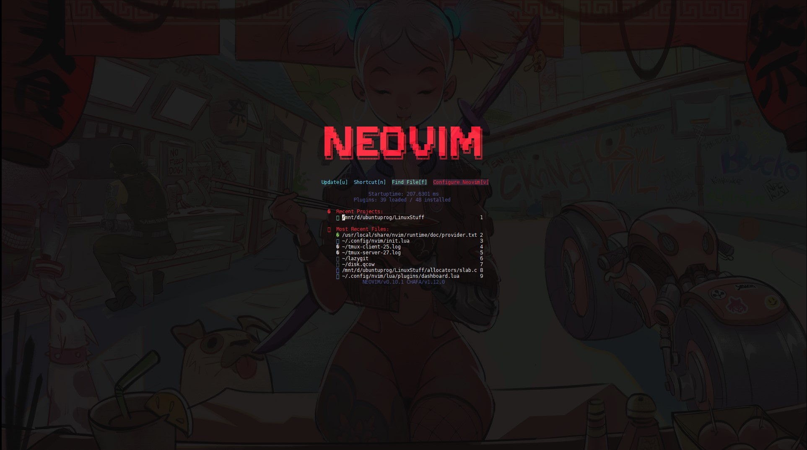
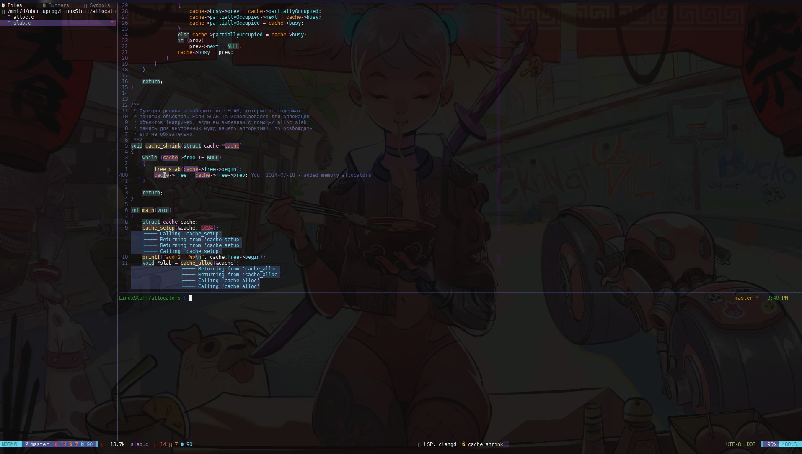
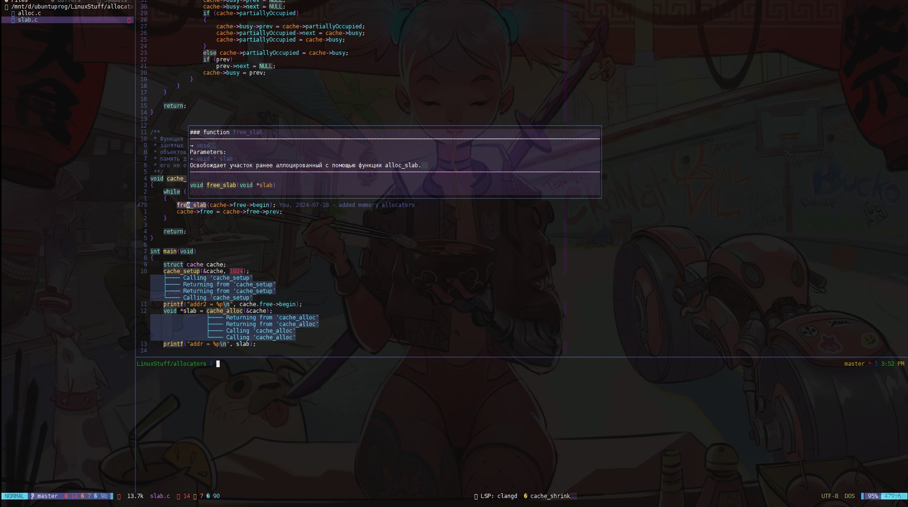
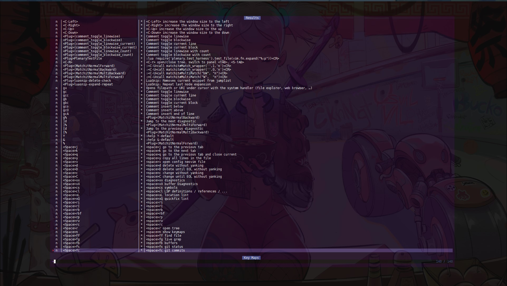
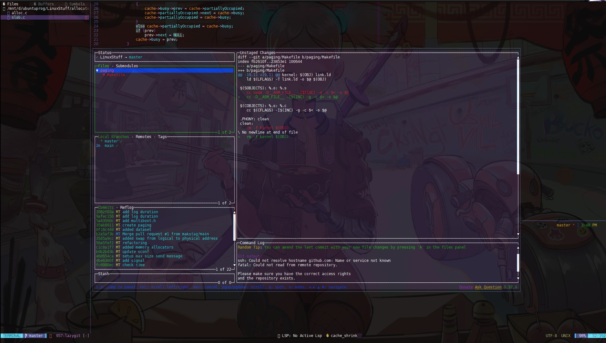
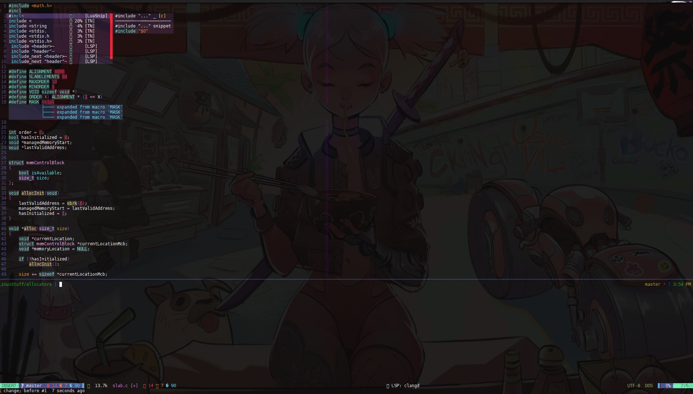

<div align="center">
    
</div>  


### Install [neovim](doc/install_neovim.md) 
```ssh
git clone https://github.com/makstag/nvim.git ~/.config/nvim
```
Neovim needs to be run a couple of times  

### Gallery  

<details>
<summary>
📷 Screenshots
</summary>
<div align="center">
     
     
     
</div>  
</details>

## Useful link  

[Keymaps](doc/keymaps.txt)  
https://vim.rtorr.com/  
https://mnorin.com/goryachie-klavishi-vim.html  

[Vim tutorial(ru)](https://www.youtube.com/playlist?list=PL8hRAtHSjAgZv7WFVDvQzzU-WoL-7jZGJ)  

## TODO  
Plugins: neotest, indent-blankline, whichkey 
