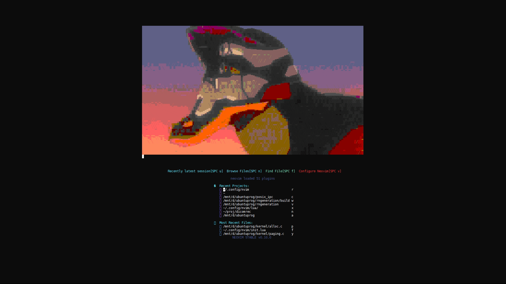

    

## Useful link  
https://mnorin.com/goryachie-klavishi-vim.html  
https://www.youtube.com/playlist?list=PL8hRAtHSjAgZv7WFVDvQzzU-WoL-7jZGJ  vim tutorial 
## Update commands neovim  
:PackerUpdate  
:TSUpdate  
:TSUpdateSync  
:MasonUpdate  
## TODO    
